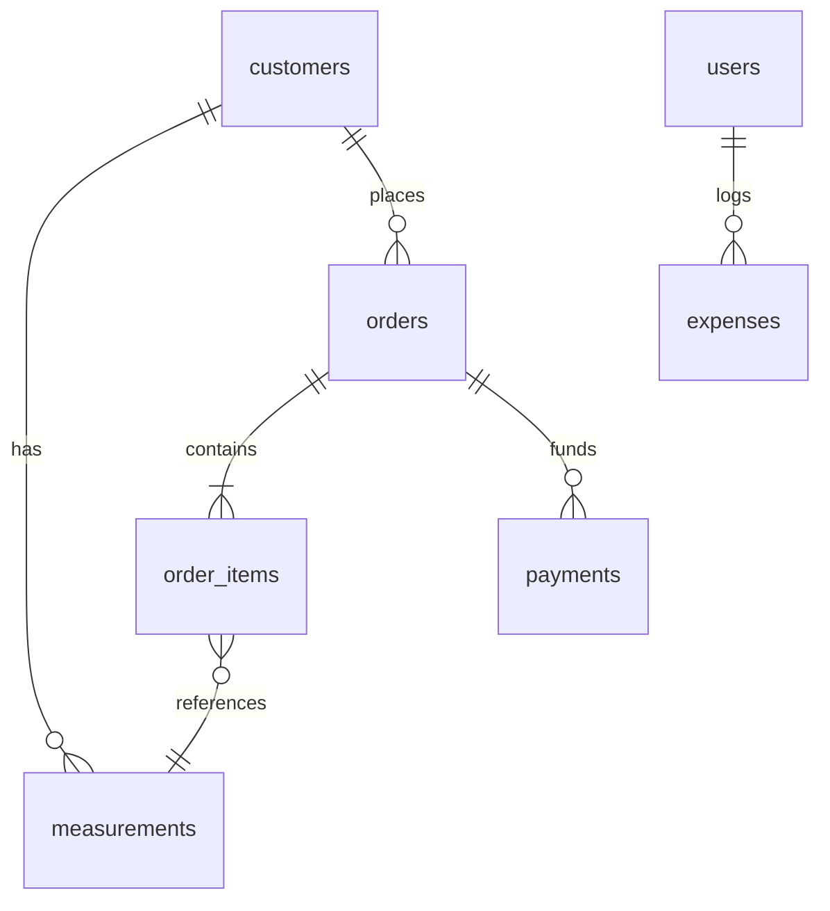

# Engineering Specification: Tailor Shop Management System (Darzi Pro)

This document details the production-grade engineering design, system architecture, database schema, and operational strategies for the **Tailor Shop Management System** (Darzi Pro). It serves as the single source of truth for developer onboarding, system integration, and implementation details.

---

## 1. System Architecture

The application is built on a **multi-process architecture** leveraging **Electron** for the desktop shell, **Angular 20** for the frontend user interface, and **SQLite + TypeORM** for offline-first local data persistence.

```mermaid
graph TD
    subgraph Renderer Process (Angular 20)
        UI[Angular Component / Views] <--> Signals[Angular Signals State Layer]
        Signals <--> CoreServices[Angular Core Wrapper Services]
        CoreServices <--> BridgeAPI[window.api / Context Bridge]
    end

    subgraph Preload Script
        BridgeAPI <--> Preload[preload.js / ipcRenderer]
    end

    subgraph Main Process (Electron / Node.js)
        Preload <--> IPCMain[ipcMain Listeners]
        IPCMain <--> Controllers[Main Controllers / Service Layer]
        Controllers <--> Repos[TypeORM Repositories]
        Repos <--> Entities[TypeORM Entities]
        Controllers <--> PDFEngine[PDFMake Engine]
        Controllers <--> PrintService[Electron Printing Service]
        Controllers <--> FS[Node.js File System]
    end

    subgraph Database
        Entities <--> SQLiteDB[(SQLite DB file)]
    end
    
    subgraph Filesystem
        FS <--> Backups[(Backup Files)]
        FS <--> Logs[(Log Files)]
    end
```

### Process Isolation and Communication
1. **Main Process (Node.js)**: Responsible for native OS interactions, database connections, local file system access, window lifecycle management, printing orchestration, and backup scheduling.
2. **Renderer Process (Chromium/Angular)**: Serves the single-page application. Security guidelines mandate that the renderer process runs with `contextIsolation: true` and `nodeIntegration: false`. No Node.js APIs are directly accessible to Angular.
3. **Preload Script**: Acts as an isolated bridge. It exposes a strictly whitelisted, safe API to the renderer process via `contextBridge.exposeInMainWorld()`.

---

## 2. Folder Structure

The repository organizes Electron and Angular code into a unified structure, separating concerns between the Main and Renderer processes while enforcing Angular's feature-based module boundaries and Signal-based state management.

```text
darzi-pro/
├── Docs/                       # Product and design specifications
│   ├── PRD.md
│   └── Design.md
├── src/                        # Application source
│   ├── main/                   # Electron Main Process (Node.js)
│   │   ├── config/             # DB & App configurations
│   │   │   └── data-source.ts  # TypeORM configuration and initialization
│   │   ├── database/           # Database layer
│   │   │   ├── entities/       # TypeORM entity schemas
│   │   │   │   ├── user.entity.ts
│   │   │   │   ├── customer.entity.ts
│   │   │   │   ├── measurement.entity.ts
│   │   │   │   ├── order.entity.ts
│   │   │   │   ├── order-item.entity.ts
│   │   │   │   ├── payment.entity.ts
│   │   │   │   ├── inventory.entity.ts
│   │   │   │   ├── expense.entity.ts
│   │   │   │   └── setting.entity.ts
│   │   │   └── migrations/     # Database migration scripts
│   │   ├── services/           # Operating system integration services
│   │   │   ├── print.service.ts
│   │   │   ├── backup.service.ts
│   │   │   └── pdf.service.ts
│   │   ├── ipc/                # IPC Handlers (Routes) mapping to DB & services
│   │   │   ├── auth.ipc.ts
│   │   │   ├── customer.ipc.ts
│   │   │   ├── order.ipc.ts
│   │   │   ├── payment.ipc.ts
│   │   │   ├── inventory.ipc.ts
│   │   │   ├── expense.ipc.ts
│   │   │   └── system.ipc.ts
│   │   └── index.ts            # Electron main process entry point
│   ├── preload/                # IPC Context Bridge
│   │   └── index.ts            # Preload script defining window.api
│   └── renderer/               # Angular 20 Renderer Process
│       ├── index.html          # HTML entry point
│       ├── main.ts             # Angular bootstrap file
│       ├── app/                # Angular application module roots
│       │   ├── app.config.ts   # Core application providers (Store, Routing, animations)
│       │   ├── app.routes.ts   # Lazy-loaded root application routes
│       │   ├── app.component.ts# Root container component
│       │   ├── core/           # Singleton services & state infrastructure
│       │   │   ├── services/   # Renderer-side services wrapper for window.api
│       │   │   │   ├── auth.service.ts
│       │   │   │   ├── customer.service.ts
│       │   │   │   ├── order.service.ts
│       │   │   │   ├── payment.service.ts
│       │   │   │   ├── inventory.service.ts
│       │   │   │   ├── expense.service.ts
│       │   │   │   └── system.service.ts
│       │   │   ├── guards/     # Auth and Role guards
│       │   │   └── interceptors/
│       │   ├── shared/         # Shared assets and UI elements
│       │   │   ├── components/ # Reusable UI components (buttons, search-bar, UI cards)
│       │   │   ├── pipes/      # Reusable template formatting pipes
│       │   │   ├── directives/ # Reusable attributes
│       │   │   └── material.module.ts # Angular Material imports export
│       │   └── features/       # Feature Modules (Lazy-loaded)
│       │       ├── auth/
│       │       ├── dashboard/
│       │       ├── customers/
│       │       ├── orders/
│       │       ├── payments/
│       │       ├── inventory/  # Standalone inventory management feature
│       │       ├── expenses/   # Standalone expenses tracking feature
│       │       ├── reports/
│       │       └── settings/
│       └── assets/             # Static UI icons & images
├── package.json                # Project dependencies and workspace configurations
├── tsconfig.json               # Global TypeScript configurations
└── tsconfig.renderer.json      # Angular TypeScript compiler configurations
```

---

## 3. Database Schema

The database uses SQLite, managed via TypeORM. Columns are strictly typed, indexing is applied to query targets (e.g., phone numbers, names, statuses, receipt numbers), and referential integrity is enforced via foreign keys.

### Entity Definitions

#### 1. `users` (User Account Information)
*Stores authentication and authorization data for system operators, supporting username/password and PIN login.*
| Column | Type | Constraints | Description |
| :--- | :--- | :--- | :--- |
| `id` | `INTEGER` | Primary Key, Auto-Increment | Unique identifier |
| `username` | `VARCHAR` | Unique, Not Null | Unique login name |
| `fullName` | `VARCHAR` | Not Null | User's visual name |
| `passwordHash`| `VARCHAR` | Not Null | Hashed password (scrypt/PBKDF2) |
| `pinHash` | `VARCHAR` | Nullable | Hashed 4-to-6 digit login PIN (scrypt/PBKDF2) |
| `role` | `VARCHAR` | Not Null | Enum: `'owner'`, `'staff'` |
| `status` | `VARCHAR` | Not Null, Default: `'active'`| Status: `'active'`, `'inactive'` |
| `created_at` | `DATETIME`| Default: `CURRENT_TIMESTAMP` | Audit creation timestamp |
| `updated_at` | `DATETIME`| Default: `CURRENT_TIMESTAMP` | Audit update timestamp |

#### 2. `customers` (Customer Profiles)
*Stores client identifiers, basic communication data, and customer references.*
| Column | Type | Constraints | Description |
| :--- | :--- | :--- | :--- |
| `id` | `INTEGER` | Primary Key, Auto-Increment | Unique identifier |
| `fullName` | `VARCHAR` | Not Null | Full customer name (Indexed) |
| `phoneNumber` | `VARCHAR` | Unique, Not Null | Mobile number (Indexed) |
| `address` | `TEXT` | Nullable | Physical home or work address |
| `photoPath` | `VARCHAR` | Nullable | File system path to the stored customer photo |
| `notes` | `TEXT` | Nullable | Administrative notes on customer preferences |
| `vipBadge` | `BOOLEAN` | Default: `false` | Highlighted customer status |
| `created_at` | `DATETIME`| Default: `CURRENT_TIMESTAMP` | Audit creation timestamp |
| `updated_at` | `DATETIME`| Default: `CURRENT_TIMESTAMP` | Audit update timestamp |

#### 3. `measurements` (Customer Body Metrics)
*Maintains standard and owner-customizable tailoring measurements, separated by item classification.*
| Column | Type | Constraints | Description |
| :--- | :--- | :--- | :--- |
| `id` | `INTEGER` | Primary Key, Auto-Increment | Unique identifier |
| `customerId` | `INTEGER` | Foreign Key (`customers.id`), Cascade Delete | Owner of the measurements |
| `type` | `VARCHAR` | Not Null | Enum: `'shirt'`, `'pant'`, `'shalwar_kameez'`, `'coat'`, `'waistcoat'`, `'sherwani'`, `'kurta'`, `'abaya'`, `'uniform'`, `'custom'` |
| `dimensions` | `TEXT` | Not Null (JSON TypeORM Column) | Detailed sizes (Inches, see details below) |
| `fabricInstructions`| `TEXT` | Nullable | Shrinking, pressing, or texture rules |
| `stitchingInstructions`| `TEXT`| Nullable | Pocket styling, pleat, collar design rules |
| `specialRequests` | `TEXT` | Nullable | Client-specific bespoke adjustments |
| `created_at` | `DATETIME`| Default: `CURRENT_TIMESTAMP` | Audit creation timestamp |
| `updated_at` | `DATETIME`| Default: `CURRENT_TIMESTAMP` | Audit update timestamp |

> **Measurement JSON Schema (`dimensions` field contents mapping by `type`):**
> * **`shirt`**: `{ neck: number, chest: number, waist: number, shoulder: number, sleeveLength: number, shirtLength: number }`
> * **`pant`**: `{ waist: number, hip: number, thigh: number, length: number, bottomWidth: number }`
> * **`shalwar_kameez` / `kurta`**: `{ chest: number, waist: number, shoulder: number, armLength: number, collar: number, kameezLength: number, shalwarLength: number }`
> * **`coat` / `waistcoat` / `sherwani`**: `{ chest: number, waist: number, shoulder: number, backLength: number, sleeveLength: number }`
> * **`abaya` / `uniform`**: `{ shoulder: number, chest: number, sleeveLength: number, totalLength: number, bottomWidth: number }`

#### 4. `orders` (Order Metadata)
*Aggregates order state, workflow milestones, and financial summaries.*
| Column | Type | Constraints | Description |
| :--- | :--- | :--- | :--- |
| `id` | `INTEGER` | Primary Key, Auto-Increment | Internal unique identifier |
| `receiptNumber` | `VARCHAR` | Unique, Not Null | Public-facing unique alphanumeric invoice number (Indexed) |
| `customerId` | `INTEGER` | Foreign Key (`customers.id`), Not Null | Client who placed the order |
| `orderDate` | `DATE` | Not Null | Date order was placed |
| `deliveryDate`| `DATE` | Not Null | Projected delivery deadline (Indexed) |
| `urgencyLevel`| `VARCHAR` | Not Null, Default: `'medium'` | Enum: `'low'`, `'medium'`, `'high'` |
| `status` | `VARCHAR` | Not Null, Default: `'Pending'` | Enum: `'Pending'`, `'Cutting'`, `'Stitching'`, `'Finishing'`, `'Ready'`, `'Delivered'` |
| `totalAmount` | `DECIMAL(10,2)`| Not Null, Default: `0.00` | Aggregated cost of all sub-items |
| `advanceReceived`| `DECIMAL(10,2)`| Not Null, Default: `0.00` | Payment collected at order creation |
| `balanceAmount`| `DECIMAL(10,2)`| Not Null, Default: `0.00` | Calculated outstanding balance |
| `created_at` | `DATETIME`| Default: `CURRENT_TIMESTAMP` | Audit creation timestamp |
| `updated_at` | `DATETIME`| Default: `CURRENT_TIMESTAMP` | Audit update timestamp |

#### 5. `order_items` (Bespoke Garments within an Order)
*Itemizes the individual pieces contained in an overall client order.*
| Column | Type | Constraints | Description |
| :--- | :--- | :--- | :--- |
| `id` | `INTEGER` | Primary Key, Auto-Increment | Unique identifier |
| `orderId` | `INTEGER` | Foreign Key (`orders.id`), Cascade Delete | Reference to parent order |
| `garmentType` | `VARCHAR` | Not Null | Enum: `'shirt'`, `'pant'`, `'shalwar_kameez'`, `'coat'`, `'waistcoat'`, `'sherwani'`, `'kurta'`, `'abaya'`, `'uniform'`, `'custom'` |
| `quantity` | `INTEGER` | Not Null, Default: `1` | Number of identical garments |
| `fabricDetails`| `TEXT` | Nullable | Material brand, color, length, customer-owned status |
| `stitchingNotes`| `TEXT` | Nullable | Unique tailors notes for this garment item |
| `measurementId`| `INTEGER` | Foreign Key (`measurements.id`), Set Null | Static reference snapshot of size used |
| `unitPrice` | `DECIMAL(10,2)`| Not Null | Cost for a single piece |
| `created_at` | `DATETIME`| Default: `CURRENT_TIMESTAMP` | Audit creation timestamp |
| `updated_at` | `DATETIME`| Default: `CURRENT_TIMESTAMP` | Audit update timestamp |

#### 6. `payments` (Financial Log)
*Audit trail for all transaction events.*
| Column | Type | Constraints | Description |
| :--- | :--- | :--- | :--- |
| `id` | `INTEGER` | Primary Key, Auto-Increment | Unique payment database reference |
| `receiptNumber` | `VARCHAR` | Unique, Not Null | Unique transaction receipt identifier (Indexed) |
| `orderId` | `INTEGER` | Foreign Key (`orders.id`), Restrict Delete | Target order of transaction |
| `amount` | `DECIMAL(10,2)`| Not Null | Numeric funds transacted |
| `paymentMethod`| `VARCHAR` | Not Null | Enum: `'cash'`, `'bank_transfer'`, `'easypaisa'`, `'jazzcash'` |
| `paymentDate` | `DATETIME`| Not Null, Default: `CURRENT_TIMESTAMP` | Payment timestamp |
| `notes` | `TEXT` | Nullable | Reference numbers (e.g. bank slip, mobile txn id) |
| `created_at` | `DATETIME`| Default: `CURRENT_TIMESTAMP` | Audit creation timestamp |

#### 7. `inventory` (Material & Supply Tracking)
*Tracks sewing materials, threads, buttons, and physical goods in stock.*
| Column | Type | Constraints | Description |
| :--- | :--- | :--- | :--- |
| `id` | `INTEGER` | Primary Key, Auto-Increment | Unique identifier |
| `name` | `VARCHAR` | Unique, Not Null | Item display name (Indexed) |
| `quantity` | `DECIMAL(10,2)`| Not Null, Default: `0.00` | Current quantity on hand |
| `unit` | `VARCHAR` | Not Null | Stock unit (e.g., `'meters'`, `'pieces'`, `'rolls'`) |
| `minimumQuantity`| `DECIMAL(10,2)`| Not Null, Default: `0.00` | Reorder threshold warning level |
| `created_at` | `DATETIME`| Default: `CURRENT_TIMESTAMP` | Audit creation timestamp |
| `updated_at` | `DATETIME`| Default: `CURRENT_TIMESTAMP` | Audit update timestamp |

#### 8. `expenses` (Operational Outflows)
*Tracks utility bills, salaries, rent, and overhead costs.*
| Column | Type | Constraints | Description |
| :--- | :--- | :--- | :--- |
| `id` | `INTEGER` | Primary Key, Auto-Increment | Unique identifier |
| `title` | `VARCHAR` | Not Null | Short transaction description |
| `amount` | `DECIMAL(10,2)`| Not Null | Cost of expense |
| `expenseDate` | `DATE` | Not Null | Operational transaction date (Indexed) |
| `category` | `VARCHAR` | Not Null | Enum: `'Rent'`, `'Electricity'`, `'Salary'`, `'Tea'`, `'Miscellaneous'` (Indexed) |
| `notes` | `TEXT` | Nullable | Audit references or custom details |
| `created_at` | `DATETIME`| Default: `CURRENT_TIMESTAMP` | Audit creation timestamp |
| `updated_at` | `DATETIME`| Default: `CURRENT_TIMESTAMP` | Audit update timestamp |

#### 9. `settings` (Application Configurations)
*Stores key-value configurations for the application environment.*
| Column | Type | Constraints | Description |
| :--- | :--- | :--- | :--- |
| `key` | `VARCHAR` | Primary Key | Unique settings key configuration |
| `value` | `TEXT` | Not Null | Setting configuration content (Serialized string or JSON) |

### Entity Relationships



---

## 4. Electron Architecture

The Electron layer manages the desktop container, implements high-level system services, and provides a secure Bridge API using Context Isolation.

```
┌────────────────────────────────────────────────────────┐
│                    Renderer Process                    │
│                                                        │
│   [ Angular Components ] <---> [ Renderer Services ]   │
└─────────────────────────┬──────────────────────────────┘
                          │ (Calls Window API method)
                          ▼
┌────────────────────────────────────────────────────────┐
│                     Preload Script                     │
│                                                        │
│    Exposes safe channel wrappers using ContextBridge    │
└─────────────────────────┬──────────────────────────────┘
                          │ (ipcRenderer.invoke)
                          ▼ (Crosses process boundary)
┌────────────────────────────────────────────────────────┐
│                      Main Process                      │
│                                                        │
│    [ ipcMain.handle ] <---> [ App Controller Layer ]   │
│                                      │                 │
│                                      ▼                 │
│                      [ SQLite / TypeORM Persistence ]  │
└────────────────────────────────────────────────────────┘
```

### Main Window Setup and Lifecycle
* Context isolation (`contextIsolation: true`) is enabled.
* Node Integration (`nodeIntegration: false`) is disabled within WebPreferences to prevent untrusted JS executing OS calls.
* Preload script is specified at path: `path.join(__dirname, '../preload/index.js')`.
* Window configuration is optimized for desktop usage: `minWidth: 1280`, `minHeight: 800`.
* Handles the `'ready-to-show'` event to gracefully display the window, preventing rendering flash.

### Context Bridge Implementation
The Preload script (`src/preload/index.ts`) sanitizes communication by exposing specific IPC invocations:

```typescript
import { contextBridge, ipcRenderer } from 'electron';

contextBridge.exposeInMainWorld('api', {
  auth: {
    login: (credentials: any) => ipcRenderer.invoke('auth:login', credentials),
    loginWithPIN: (pin: string) => ipcRenderer.invoke('auth:loginWithPIN', pin),
    logout: () => ipcRenderer.invoke('auth:logout'),
    getCurrentUser: () => ipcRenderer.invoke('auth:getCurrentUser')
  },
  customers: {
    get: (params: any) => ipcRenderer.invoke('customer:get', params),
    create: (data: any) => ipcRenderer.invoke('customer:create', data),
    update: (id: number, data: any) => ipcRenderer.invoke('customer:update', { id, data }),
    delete: (id: number) => ipcRenderer.invoke('customer:delete', id)
  },
  orders: {
    get: (params: any) => ipcRenderer.invoke('order:get', params),
    create: (data: any) => ipcRenderer.invoke('order:create', data),
    updateStatus: (id: number, status: string) => ipcRenderer.invoke('order:updateStatus', { id, status }),
    printReceipt: (orderId: number) => ipcRenderer.invoke('order:printReceipt', orderId)
  },
  payments: {
    create: (data: any) => ipcRenderer.invoke('payment:create', data),
    getByOrder: (orderId: number) => ipcRenderer.invoke('payment:getByOrder', orderId)
  },
  inventory: {
    get: (params: any) => ipcRenderer.invoke('inventory:get', params),
    create: (data: any) => ipcRenderer.invoke('inventory:create', data),
    update: (id: number, data: any) => ipcRenderer.invoke('inventory:update', { id, data }),
    delete: (id: number) => ipcRenderer.invoke('inventory:delete', id)
  },
  expenses: {
    get: (params: any) => ipcRenderer.invoke('expense:get', params),
    create: (data: any) => ipcRenderer.invoke('expense:create', data),
    delete: (id: number) => ipcRenderer.invoke('expense:delete', id)
  },
  system: {
    getSettings: () => ipcRenderer.invoke('system:getSettings'),
    saveSettings: (settings: any) => ipcRenderer.invoke('system:saveSettings', settings),
    backup: () => ipcRenderer.invoke('system:backup'),
    restore: (filePath: string) => ipcRenderer.invoke('system:restore', filePath)
  }
});
```

---

## 5. Angular Module Structure

Adhering to **Angular 20 standalone components**, the application uses routing configuration and standard provider initialization instead of legacy `NgModule` modules.

### Dependency Resolution Configuration (`src/renderer/app/app.config.ts`)
* **`provideRouter(routes, withHashLocation())`**: Enabled with HashLocationStrategy to support localized file system relative resolution (`file://`) common in packaged Electron binaries.
* **`provideAnimations()`**: Integrates Angular Material typography, rendering, and interaction lifecycles.
* State management is initialized using Angular Injectable Services managing **Angular Signals** directly. No custom library providers are required, keeping dependencies clean and avoiding legacy NgRx module setups.

### Application Layout Shell
The root view (`app.component.html`) outlines a desktop layout:
```html
<div class="app-container">
  <app-header class="app-header"></app-header>
  <div class="app-body">
    <app-sidebar class="app-sidebar"></app-sidebar>
    <main class="app-content-view">
      <router-outlet></router-outlet>
    </main>
  </div>
</div>
```

### Lazy Loaded Routes (`src/renderer/app/app.routes.ts`)
```typescript
import { Routes } from '@angular/router';
import { AuthGuard } from './core/guards/auth.guard';
import { RoleGuard } from './core/guards/role.guard';

export const routes: Routes = [
  { path: '', redirectTo: 'login', pathMatch: 'full' },
  { 
    path: 'login', 
    loadComponent: () => import('./features/auth/login.component').then(m => m.LoginComponent) 
  },
  {
    path: 'dashboard',
    loadComponent: () => import('./features/dashboard/dashboard.component').then(m => m.DashboardComponent),
    canActivate: [AuthGuard]
  },
  {
    path: 'customers',
    loadComponent: () => import('./features/customers/customers-list.component').then(m => m.CustomersListComponent),
    canActivate: [AuthGuard]
  },
  {
    path: 'orders',
    loadComponent: () => import('./features/orders/orders-list.component').then(m => m.OrdersListComponent),
    canActivate: [AuthGuard]
  },
  {
    path: 'inventory',
    loadComponent: () => import('./features/inventory/inventory-list.component').then(m => m.InventoryListComponent),
    canActivate: [AuthGuard]
  },
  {
    path: 'expenses',
    loadComponent: () => import('./features/expenses/expenses.component').then(m => m.ExpensesComponent),
    canActivate: [AuthGuard]
  },
  {
    path: 'reports',
    loadComponent: () => import('./features/reports/reports.component').then(m => m.ReportsComponent),
    canActivate: [AuthGuard, RoleGuard],
    data: { expectedRole: 'owner' }
  },
  {
    path: 'settings',
    loadComponent: () => import('./features/settings/settings.component').then(m => m.SettingsComponent),
    canActivate: [AuthGuard, RoleGuard],
    data: { expectedRole: 'owner' }
  }
];
```

---

## 6. SQLite Integration Strategy

Since SQLite is a C++ native dependency, database initialization, schema definitions, migrations, and operations execute purely in the **Main Process**.

```
Renderer Process (Angular)
   └── Inject CustomerStateService
         └── Call from(window.api.customers.get(query))
               │
               ▼ (IPC invoke: 'customer:get')
Main Process (Electron)
   ├── IPC Router Listeners (ipcMain.handle)
   │     └── Invokes CustomerController.getCustomers(query)
   │           │
   │           ▼
   └── Data-Access Service
         └── TypeORM Repository: CustomerRepository.find(...)
               └── Runs SQL Query against local SQLite file
```

### Initializing TypeORM
During Electron's startup sequence (`index.ts`), the Main Process runs initialization within the application event lifecycle:
1. Initialize the TypeORM `DataSource` with the local SQLite file location.
2. Run database migrations to guarantee that schemas match definitions.
3. Establish IPC listener routes targeting connection pools.

### Configuration (`src/main/config/data-source.ts`)
```typescript
import { DataSource } from 'typeorm';
import { app } from 'electron';
import * as path from 'path';
import { User } from '../database/entities/user.entity';
import { Customer } from '../database/entities/customer.entity';
import { Measurement } from '../database/entities/measurement.entity';
import { Order } from '../database/entities/order.entity';
import { OrderItem } from '../database/entities/order-item.entity';
import { Payment } from '../database/entities/payment.entity';
import { Inventory } from '../database/entities/inventory.entity';
import { Expense } from '../database/entities/expense.entity';
import { Setting } from '../database/entities/setting.entity';

const dbPath = path.join(
  app.getPath('userData'), 
  'database.sqlite'
);

export const AppDataSource = new DataSource({
  type: 'sqlite',
  database: dbPath,
  synchronize: false, // Always use migrations in production
  logging: process.env.NODE_ENV !== 'production',
  entities: [User, Customer, Measurement, Order, OrderItem, Payment, Inventory, Expense, Setting],
  migrations: [path.join(__dirname, '../database/migrations/*.js')],
  migrationsRun: true
});
```

### Database Wrapper Service in Angular
Angular feature components call typed Angular core services wrapper functions, wrapping the context bridge `window.api` calls into standard RxJS streams:

```typescript
import { Injectable } from '@angular/core';
import { Observable, from } from 'rxjs';

@Injectable({
  providedIn: 'root'
})
export class CustomerService {
  getCustomers(params: any): Observable<any> {
    return from(window.api.customers.get(params));
  }

  createCustomer(data: any): Observable<any> {
    return from(window.api.customers.create(data));
  }
}
```

---

## 7. State Management Strategy

In compliance with your specifications, **NgRx is completely removed**. Unidirectional state management is built natively using **Angular Signals and RxJS**.

```
    [ Component Action / Form Submit ] 
                   │  
                   ▼ (Calls State Service Method)
     [ Signal Store Service (State Layer) ] 
       ├── Updates Loading Signal (true)
       ├── Executes RxJS Async stream (via window.api IPC)
       │     └── Returns data payload from Main Process
       └── Updates State Signals directly (loading=false, data=payload)
                   │
                   ▼ (Triggers Fine-Grained CD)
         [ UI Template Rendered ]
```

### State Store Design Pattern
Each application feature contains a dedicated state manager class marked with `@Injectable({ providedIn: 'root' })`. It manages:
* **Private writable signals** to control mutations.
* **Public read-only signals** (e.g. `asReadonly()`) exposed to components.
* **Computed signals** representing derived selectors.
* **RxJS pipes** to orchestrate asynchronous backend calls.

### Component Integration Example (`src/renderer/app/features/customers/customers-store.service.ts`)
```typescript
import { Injectable, signal, computed, inject } from '@angular/core';
import { CustomerService } from '../../core/services/customer.service';
import { finalize } from 'rxjs/operators';

interface CustomerState {
  items: any[];
  filterQuery: string;
  loading: boolean;
  error: string | null;
}

@Injectable({
  providedIn: 'root'
})
export class CustomersStore {
  private readonly customerService = inject(CustomerService);

  // Private Writable Signals representing state slices
  #items = signal<any[]>([]);
  #filterQuery = signal<string>('');
  #loading = signal<boolean>(false);
  #error = signal<string | null>(null);

  // Public Read-Only Signals exposed to UI components
  public readonly items = this.#items.asReadonly();
  public readonly loading = this.#loading.asReadonly();
  public readonly error = this.#error.asReadonly();
  public readonly filterQuery = this.#filterQuery.asReadonly();

  // Computed Signal acting as a memoized state selector
  public readonly filteredCustomers = computed(() => {
    const query = this.#filterQuery().toLowerCase();
    const list = this.#items();
    if (!query) return list;
    return list.filter(c => 
      c.fullName.toLowerCase().includes(query) || 
      c.phoneNumber.includes(query)
    );
  });

  // Action methods
  public setFilter(query: string): void {
    this.#filterQuery.set(query);
  }

  public loadCustomers(): void {
    this.#loading.set(true);
    this.#error.set(null);
    this.customerService.getCustomers({})
      .pipe(finalize(() => this.#loading.set(false)))
      .subscribe({
        next: (data) => this.#items.set(data),
        error: (err) => this.#error.set(err.message || 'Failed to load customers')
      });
  }
}
```

---

## 8. Authentication Design

Persistent local security safeguards sensitive customer details and administrative financial configurations, operating completely offline and supporting **Standard Credentials** and **PIN Login**.

### Authentication Flow
1. **Password Authentication**: Standard login via a password. Hashed inside the Main Process using **scrypt** with a salt length of `16` and a key length of `64` to verify.
2. **PIN-Based Authentication**: Quick access using a 4-to-6 digit PIN, ideal for rapid staff switching. The PIN is hashed using scrypt and validated against `pinHash` in the `users` table.
3. **Session Lifecycle**: On verification, a session token is generated. The main process holds a secure, memory-isolated representation of the logged-in user context. This state is broadcast to the renderer process during authorization checks.

### Role-Based Access Control (RBAC)
Role levels determine UI navigation boundaries:
* **`owner`**: Access to Dashboard, Customers, Orders, Payments, Inventory, Expenses, Reports, and Settings.
* **`staff`**: Access to Dashboard, Customers, Orders, Inventory, and limited Payment functions. Cannot navigate to `/reports` or `/settings`.

### Route Shielding (`src/renderer/app/core/guards/role.guard.ts`)
```typescript
import { Injectable, inject } from '@angular/core';
import { CanActivate, Router, ActivatedRouteSnapshot } from '@angular/router';
import { AuthService } from '../services/auth.service';

@Injectable({
  providedIn: 'root'
})
export class RoleGuard implements CanActivate {
  private readonly authService = inject(AuthService);
  private readonly router = inject(Router);

  canActivate(route: ActivatedRouteSnapshot) {
    const expectedRole = route.data['expectedRole'];
    const currentRole = this.authService.currentUserRole(); // Angular Signal helper

    if (currentRole === expectedRole || currentRole === 'owner') {
      return true;
    }
    
    this.router.navigate(['/dashboard']);
    return false;
  }
}
```

---

## 9. Printing Architecture

Printing operates silently behind the scenes without user intervention, bypassing standard print dialog selection prompts.

### Execution Strategy
1. **Hidden UI Window**: The Main process maintains a separate `BrowserWindow` instance configured with `{ show: false }`.
2. **Template Rendering**: When a print request is received from the UI, the main process pulls the layout configuration from settings (e.g. 80mm thermal configuration vs A4 standard invoice style).
3. **Layout Generation**: The system builds a HTML or SVG representation of the print slip, including the **Receipt Number** (orders and payments).
4. **Execution**: The PDF layout buffer is written to the hidden printing window. The window runs `webContents.print()` with parameters:
   ```typescript
   {
     silent: true,
     printBackground: true,
     deviceName: defaultSystemPrinterName,
     pageSize: { width: 80000, height: 220000 } // 80mm standard roll height limit
   }
   ```
5. **Memory Cleanup**: On success or print exception, the hidden window is reset and memory is garbage collected.

---

## 10. Reporting Architecture

The system generates aggregate intelligence calculations locally. The engine balances fast calculation times with visual representations.

### Aggregation Queries
To maintain responsive rendering loops for 100,000+ records, queries leverage raw SQLite index paths:

```sql
-- Monthly Net Margin Aggregates (Revenue minus Expenses)
SELECT 
  Months.Month,
  COALESCE(Revenue.TotalRevenue, 0) AS Revenue,
  COALESCE(Expenses.TotalExpense, 0) AS Expenses,
  (COALESCE(Revenue.TotalRevenue, 0) - COALESCE(Expenses.TotalExpense, 0)) AS NetMargin
FROM (
  SELECT strftime('%Y-%m', paymentDate) AS Month FROM payments
  UNION
  SELECT strftime('%Y-%m', expenseDate) AS Month FROM expenses
) Months
LEFT JOIN (
  SELECT strftime('%Y-%m', paymentDate) AS Month, SUM(amount) AS TotalRevenue
  FROM payments GROUP BY Month
) Revenue ON Months.Month = Revenue.Month
LEFT JOIN (
  SELECT strftime('%Y-%m', expenseDate) AS Month, SUM(amount) AS TotalExpense
  FROM expenses GROUP BY Month
) Expenses ON Months.Month = Expenses.Month
ORDER BY Months.Month DESC;

-- Low Inventory Warning Query
SELECT id, name, quantity, minimumQuantity 
FROM inventory 
WHERE quantity <= minimumQuantity;
```

### Charting
Reports render on-screen charts using **`ng2-charts`** (wrapper for `Chart.js`). 
* Dashboard charts are configured to update reactively when underlying customer, payment, inventory, expense, or order state updates are triggered.
* Charts leverage custom palettes to align with the application design system.

### Export Services
Export processes execute in a separate worker thread or service layer in the Main Process to prevent blocking the UI event loop:
1. **PDF Export**: Built with `pdfmake`. Structured document models (customer profiles, orders, and payment histories) are built, stylized with custom fonts, and written to disk or the printer.
2. **CSV/Excel Export**: Generates comma-separated values of customer metrics, expenses, or inventory logs, and writes them to local disk using node file system utilities.

---

## 11. Backup & Restore Architecture

Protecting customer measurements, inventory counts, expenses, and transaction data is critical for offline-first applications.

```
Automatic Backup Flow:
Electron Startup
   └── Read System Settings
         └── If (autoBackupEnabled)
               └── Resolve target directory
                     └── Check last backup timestamp
                           └── If (hoursPassed > interval)
                                 └── Trigger SQLite DB File Copy
                                       └── Compress to .zip / Write to disk
                                             └── Log backup success event
```

### Strategy
1. **File-Level Backups**: SQLite's single-file database structure allows for straightforward backup procedures. Since SQLite might lock during active write operations, backup files are generated by executing a database copy via the SQLite **`VACUUM INTO`** SQL command. This generates a defragmented database snapshot file.
2. **Automated Trigger Schedules**: The Main Process schedules database exports during:
   - System Boot.
   - Application Exit (graceful shutdown routine).
   - Periodic background intervals (e.g. every 24 hours of uptime).
3. **Backup Storage Layout**:
   - Filenames include timestamps and database metadata: `darzi_pro_backup_YYYY-MM-DD_HH-mm-ss.sqlite`.
   - The backup storage path defaults to `app.getPath('documents')/DarziPro/Backups` but remains customizable via Settings.

### Restoration Sequence
1. The user picks a valid `.sqlite` backup file using the OS standard file picker dialog.
2. The Electron Main Process stops all active TypeORM database pools to release file handles.
3. The system validates the database schema integrity of the target backup file (executing an SQL query verification check).
4. The system overwrites the active database file.
5. The connection pools are re-established, and the Renderer process is reloaded using `mainWindow.reload()`.

---

## 12. Error Handling Strategy

Standardized, structured exception catching runs across both execution boundaries. This isolates faults, ensures clean recovery, and blocks unsafe application crashes.

```
Renderer Exception (Angular Component)
   └── Caught by GlobalErrorHandler
         ├── Display MatSnackBar notification (User-friendly message)
         └── Call window.api.system.logError(stackTrace)
               │
               ▼ (IPC Transfer)
Main Process Logger
   └── Write formatted stack trace to app.log
```

### UI Boundary (Renderer Process)
Angular intercepts unhandled component exceptions through a custom `ErrorHandler` implementation, showing a user-friendly alert interface:

```typescript
import { ErrorHandler, Injectable, Injector, NgZone } from '@angular/core';
import { MatSnackBar } from '@angular/material/snack-bar';

@Injectable()
export class GlobalErrorHandler implements ErrorHandler {
  constructor(
    private readonly injector: Injector,
    private readonly zone: NgZone
  ) {}

  handleError(error: any): void {
    const snackBar = this.injector.get(MatSnackBar);
    const message = error.message || 'An unexpected application error occurred.';

    this.zone.run(() => {
      snackBar.open(message, 'Dismiss', {
        duration: 5000,
        panelClass: ['error-snackbar']
      });
    });

    window.api.system.logError({
      message: error.message,
      stack: error.stack,
      source: 'renderer'
    });
  }
}
```

### Main Process Boundary
* The main process wraps handlers in `try/catch` blocks. If an operation fails, the controller returns a standardized error payload across the IPC channel:
  ```json
  {
    "success": false,
    "error": "ERR_CUSTOMER_NOT_FOUND",
    "message": "The requested customer profile does not exist."
  }
  ```
* Global uncaught exceptions are trapped by Node event listeners:
  ```typescript
  process.on('uncaughtException', (err) => {
    // Log to file, notify developers, clean handles, restart or exit safely
  });
  process.on('unhandledRejection', (reason, promise) => {
    // Log promise rejection stack traces
  });
  ```

---

## 13. Logging Strategy

Local log files are maintained inside the OS user data directory to facilitate troubleshooting.

### Logger
* Standardizes logging using the **`electron-log`** library.
* Formats logs with structural markers: `[{y}-{m}-{d} {h}:{i}:{s}.{ms}] [{level}] {text}`.
* Sets default log level dynamically:
  - Development mode: `silly` (Logs all transactions, SQL statements, and state updates).
  - Production mode: `warn` / `error` (Restricts logging to system warnings, performance thresholds, and application errors).

### Rotation Rules
To prevent log files from growing unchecked:
* Max File Size: `10MB`.
* Retention: Old files are archived up to a maximum of 5 files (`app.log.1`, `app.log.2`, etc.).
* File Path: `path.join(app.getPath('userData'), 'logs/app.log')`.

---

## 14. Testing Strategy

The testing strategy is designed to ensure correctness and maintainability across all system layers.

```
┌──────────────────────────────────────────────┐
│                  Test Suite                  │
├──────────────────────┬───────────────────────┤
│ Angular Logic        │ Jasmine / Karma       │
├──────────────────────┼───────────────────────┤
│ Node Main / DB       │ Vitest                │
├──────────────────────┼───────────────────────┤
│ System End-to-End    │ Playwright            │
└──────────────────────┴───────────────────────┘
```

### 1. Main Process Unit Tests (Vitest)
Unit tests cover DB transaction logs, database migrations, controllers, configuration logic, and file manipulation functions without starting a full window layout.
* Uses an in-memory SQLite connection (`:memory:`) configuration in Vitest tests.
* Validates TypeORM repository behaviors, constraints, cascading deletion rules, and schema migrations.

### 2. Angular Unit & Component Tests (Jasmine/Karma)
Tests focus on isolated view behaviors, model mappings, and state changes:
* **Angular Signal Store Tests**: Verifies writable signal state transitions, computed dependency updates, and RxJS-triggered asynchronous operations.
* **Component Testing**: Uses Angular Test Bed to inspect DOM templates, verify bindings against Signals, and handle event-driven inputs.
* **API Wrapper Tests**: Uses mock implementations of the `window.api` bridge interfaces.

### 3. Integration & End-to-End Tests (Playwright)
Validates key user flows end-to-end:
* Automates window instantiation through Electron integration.
* Tests user flows such as logging in, selecting customers, creating orders, inputting measurements, processing payments, checking inventory levels, logging expenses, and verifying database persistence.
* Validates offline data behavior by monitoring system behaviors when network access is cut or files are locked.
